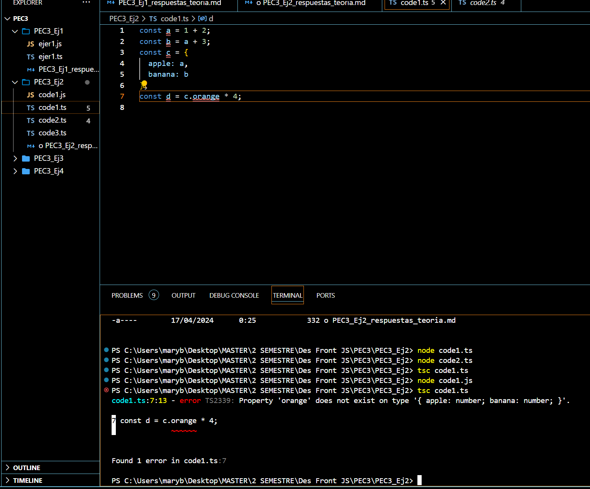

 Dentro de la imagen se puede ver como se ha modificado el valor de c, ya que he modificado c.apple por c.orange, por lo tanto esta intentando acceder a una propiedad que el objeto c no tiene, dando así un resultado de undefined y al intentar multiplicarlo por 4, js no podrá realizar esta operación y nos da un error de TypeError

1. (1 punto) Para cada uno de los valores del fichero code2.ts, ¿Qué tipo de datos
inferirá TypeScript? Explica por qué se ha inferido este tipo de datos.

Los tipos para cada variables que se ha declado son:
    Variable a: Es una variable de tipo number porque se la está inicializando con un valor numérico

    Variable b: Es una variable de tipo string porque se la está inicializando con una cadena de caracteres

    Variable c: Es una variable de tipo string, como la variable b, ya que se la está inicializando con una cadena de caracteres

    Variable d: Es una variable de tipo boolean[], ya que se la está inicializando como un array con valores booleanos 

    Variable e: Es una variable de tipo object, ya que se ha inicializado a la variable como si fuera un objeto que está formado por la propiedad type y el valor asignado es de tipo string

    Variable f: Es una variable de tipo (number|boolean)[], ya que a la variable se la a inicializado con un array que puede contener valores numéricos o booleanos

    Variable g: Es una variable de tipo number[], ya que está inicializando a la variable como un array y dentro del array va a tener un valor de tipo number

    Variable h: Es una variable de tipo null, ya que se está inicializando con el valor de null

2. (1 punto) ¿Por qué se dispara cada uno de los errores del fichero code3.ts?

    Error TS2588 -> Este error se muestra porque se está intentando asigar un valor a una constante que previamente ya ha sido inicilizada, por lo que a esa variable al ser declarada como constante no se la puede asignar ya otro valor

    Error TS2345 -> Este error se muestra porque se está intentando agregar un valor que es de tipo string a un array que se ha inicializado con valores numéricos, por lo que a este array solo se le podrán añadir valores que sean del tipo number

    Error TS2322 -> Este error se muestra porque se está intentando asignar un valor a una variable que se ha declarado previamente como never, lo cual sigifica que esta variable nunca debería de tomar un valor válido de ningún tipo

    Error TS2571 -> Este error se muestra porque se está intentando realizar una operación de multiplicación con una variable que es de tipo unknown, la cual representa  un valor desconocido y no se pueden realizar operaciones directamente con variables de este tipo

3. (0.5 puntos) ¿Cuál es la diferencia entre una clase y una interface en TypeScript?

    La diferencia entre clase e interfaza, es que la primera se utiliza para definir unos objetos con sus propiedades y métodos, proporcionando la implementación de como deben y que funciones tienen esos objetos, mientras que la interfaz se utiliza para definir tipos de objetos y establecer contratos sobre como van a ser esos objetos, sin aportar una implementación de sus métodos y propiedades

